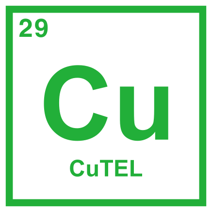
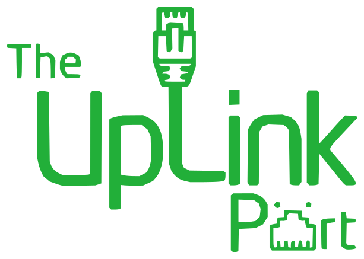

---
hide:
  - toc
icon: material/party-popper
---

# About

Link:UP is a new, non-profit and volunteer ran event for 2027, aimed at anyone with an interest in networking and telecommunications.  

The aim is for attendees to _link up_ as many devices as possible, over as many different mediums as possible, whether it's a phone, a fax machine, a television set or a DSL modem from the turn of the millennium. 

Tables will be available for hire if you want to demonstrate something, or connect to other attendees equipment - either as a "customer" or "service provider". Or if you're travelling light there will be an area where you can connect and use your portable device(s)

The event is provisionally scheduled for Saturday 10th and Sunday 11th April 2027, with a couple of hours on the Friday evening to unload and start setting up. There will also be some socialising in the evenings, most likely at a local pub. 

Link:UP is currently being organised by members of the following communities:

- [CuTEL](https://cutel.net/) - A tongue-in-cheek telecoms provider that runs copper telephone networks at events. Also [EMF Camp's](https://www.emfcamp.org/) _incumbent_ landline provider. 
- [TheUplinkPort](https://www.youtube.com/@TheUplinkPort) - A YouTube channel dedicated to exploring retro network technologies like VDSL and EFM. 
- [East Essex Hackspace](https://eehack.space/) - Our hosts!

  
  
  

